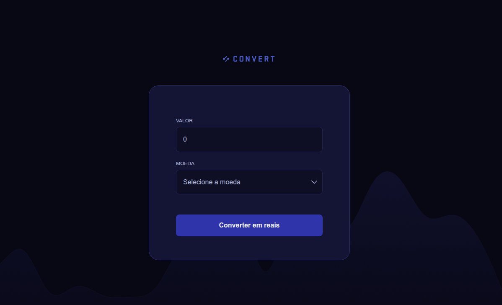

# Convert

O **Convert** é um conversor de moedas, desenvolvido com **JavaScript puro** durante a trilha de desenvolvimento **Full Stack** da [Rocketseat](https://www.rocketseat.com.br/). Ele permite converter valores entre moedas estrangeiras de forma rápida e intuitiva.

## Funcionalidades

- Conversão de moedas
- Suporte a:
  - Dólar Americano (USD)
  - Euro (EUR)
  - Libra Esterlina (GBP)

## Tecnologias Utilizadas

- HTML5
- CSS3
- JavaScript

